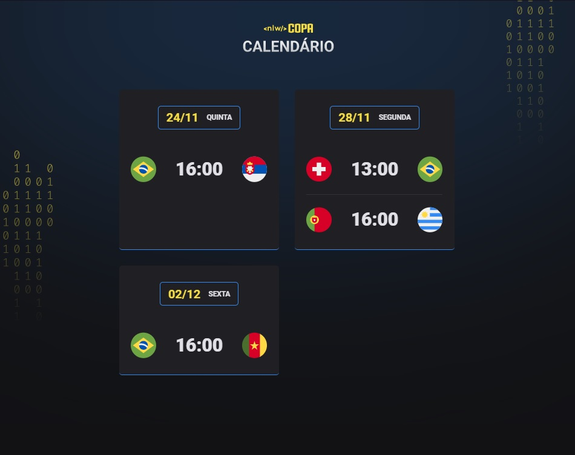

<h1 ><strong>NLW10 - Copa 2022</strong></h1>
Calendário pessoal de jogos da Copa do Mundo 2022.  

  

 

  

## 🚀 Tecnologias Utilizadas

Esse projeto foi desenvolvido com as seguintes tecnologias:

- HTML;
- CSS;
- JavaScript;
- Git e Github.

 

## 💻 Projeto

O Calendário da Copa é um projeto que mostra os jogos da Copa de 2022.

 

## ✒️ Licença

Esse projeto está sob a licença MIT.
